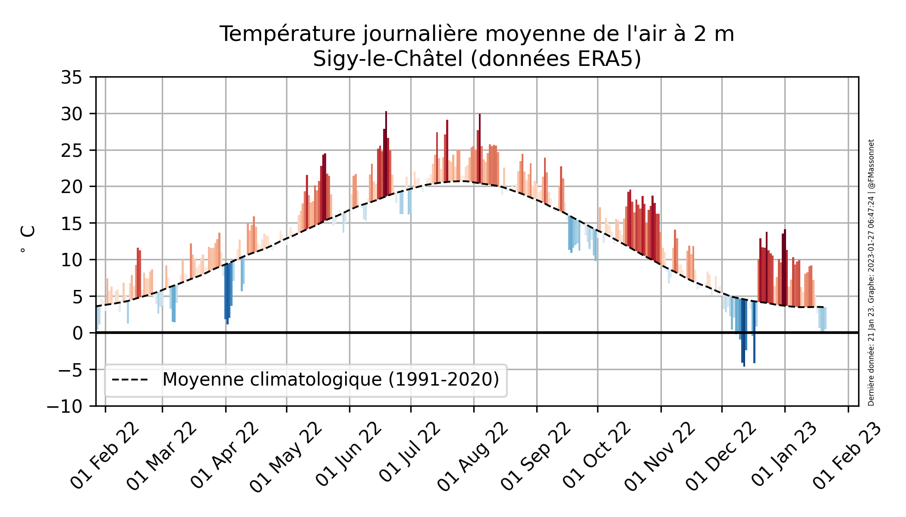
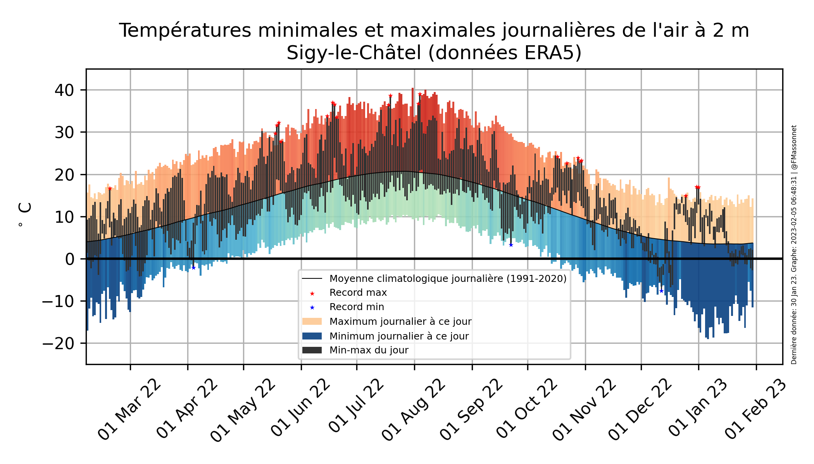

_Pour la même figure sur les  années précédentes, voir [ici](./T2mAllYears.md)_

 
 

## Bienvenue
Cette page reprend les statistiques de température de l'air à 2 mètres telles que reconstruites par la **[réanalyse atmosphérique ERA5](https://rmets.onlinelibrary.wiley.com/doi/10.1002/qj.3803)** (Hersbach et al., 2020) sur une zone de ~30 km x ~30 km située au-dessus de Sigy-le-Châtel, en quasi temps réel (délai de 6 jours). Ces données sont accessibles publiquement via le [_Climate Data Store_](https://cds.climate.copernicus.eu/cdsapp#!/dataset/reanalysis-era5-single-levels?tab=overview) du programme Copernicus d'observation de la Terre de l'Union Européenne.

**Clause de non-responsabilité**: ces données, issues d'un modèle numérique atmosphérique contraint par des observations, n'ont pas pour vocation de remplacer des données issues de stations météorologiques. Elles sont cependant suffisantes pour apprécier la variabilité saisonnière de la température, la fréquence, la durée, ou l'intensité de récentes vagues de chaleur ou de froid, et les tendances multi-décennales.

Cette page est actualisée une fois par jour, automatiquement.

Les données brutes servant à produire les figures ci-dessus sont téléchargeables ci-dessous, sous la forme de fichiers CSV lisibles par des logiciels de tableur classiques.

## Données brutes et statistiques

**[Données à l'échelle horaire (Clic droit + Enregistrer)](./output/hourly_T2M_Sigy-le-Châtel.csv)**

**[Données agrégées à l'échelle journalière (moyenne, minimum, maximum) (Clic droit + Enregistrer)](./output/dailyStatistics_T2m_Sigy-le-Châtel.csv)**

Le script (Python3) qui produit ces données est disponible [ici](./scripts/analysis_T2m.py)

## Autres lieux
(A continuer)

## Références
Hersbach, H., Bell, B., Berrisford, P., Hirahara, S., Horányi, A., Muñoz‐Sabater, J., Nicolas, J., Peubey, C., Radu, R., Schepers, D., Simmons, A., Soci, C., Abdalla, S., Abellan, X., Balsamo, G., Bechtold, P., Biavati, G., Bidlot, J., Bonavita, M., … Thépaut, J.-N. (2020). The ERA5 Global Reanalysis. Quarterly Journal of the Royal Meteorological Society, https://doi.org/10.1002/qj.3803

## Contact
Pour toute question ou suggestion d'amélioration, contacter **[François Massonnet](mailto:francois.massonnet@uclouvain.be)**

