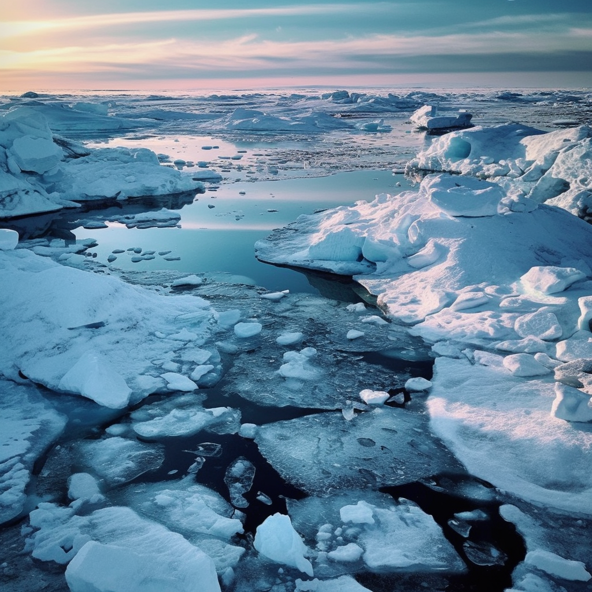
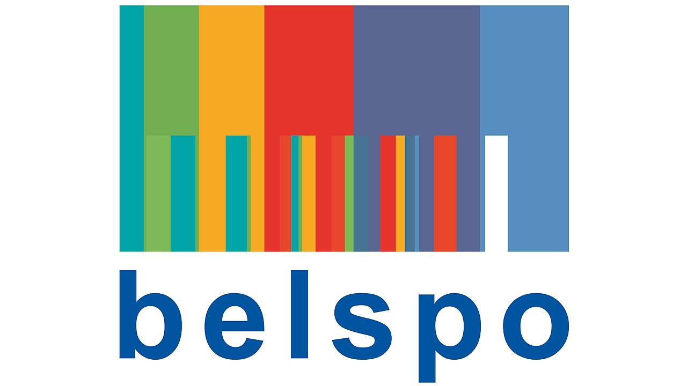
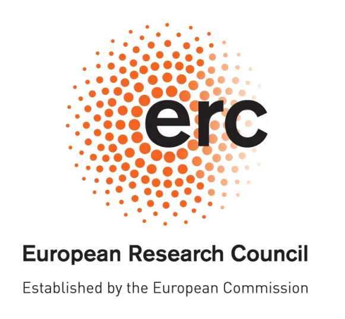

# Five PhD and post-doctoral positions are open on rapid sea ice changes, their drivers, their predictability, and their impacts at the Université catholique de Louvain (UCLouvain, Belgium)

_(Published 4th May 2023)_

As our planet faces unprecedented climate changes that manifest most evidently in polar regions, we are seeking **five talented individuals** to join us in researching the pressing questions that remain unanswered related to Arctic and Antarctic sea ice, with a focus on the climatic drivers that shape their variability at the seasonal to interannual time scale and on the long-lasting impacts of repeated sea ice anomalies on the polar and global environments.

Through three prestigious research programs, including the **European Research Council**, the **Destination Earth Initiative**, and **Belgium’s Science Policy**, you will have the opportunity to delve deep into the drivers, predictability, and impacts of extreme sea ice states and their representation in numerical models, from **state-of-the-art coupled Earth System Models to kilometer-scale prototype digital twins** currently under development.

At the Earth and Climate Center of UCLouvain, you will be part of a team with a long-standing reputation for excellence in polar research. With **connections to high-level initiatives and projects at national, European, and international levels**, you will have access to the latest research, technologies, and resources to significantly contribute to the expanding body of polar scientific knowledge.

A description of the five positions, as well as guidelines to apply, are available hereafter.

=======

## Position 1: “RESIST – Post-Doc”

- Type:         Post-Doctoral scholarship followed by fixed-term contract
- Position:     Full-time for 30 months (2.5 years)
- Net salary:   2900-3100 €/month (incl. social insurance and transportation to/from work)
- Start date:   Any time starting from now

Keywords:    Sea ice extremes, process-based understanding, nudging experiments, Arctic, Antarctic

_Description of the work:_

The successful candidate will conduct a series of sensitivity analyses with the European community Earth System Model EC-Earth3 to quantify the fraction of recent Arctic and Antarctic summer sea ice anomalies that are due to preconditioning (initial conditions) vs. large-scale drivers (winds and sea surface temperature). The emphasis will be placed on the recent sea ice lows: 2007 and 2012 for the Arctic and 2017, 2022 for the Antarctic. A thorough intercomparison will be performed to identify the hemisphere-specific mechanisms at play. The candidate will also participate in the analysis of ongoing reconstructions of the ocean—sea ice state in a hierarchy of spatial resolutions from 1° to 1/12°.

The work will be conducted in the framework of the funded project “Recent Arctic and Antarctic Sea Ice lows: Same causes, same impacTs?” (RESIST, 2023-2025) funded by the Belgian Science Policy (BELSPO). RESIST involves the Royal Meteorological Institute, with which strong interactions are foreseen.

_Expected profile:_

The successful candidate should
-   hold a PhD thesis in climatology, Earth science, or related field;
-   have published in peer-reviewed international journals;
-   have acquired experience in running large-scale ocean—sea ice and/or climate models. Being familiar with EC-Earth3 and/or the NEMO/SI3 model is an asset;
-   demonstrate verbal and written communication skills in English;
-   demonstrate autonomy, sense of initiative and proactivity.

The starting date is as soon as possible. Candidates must not have worked more than three years in Belgium before starting this position.

## Position 2: “ArcticWATCH – PhD”

- Type:		PhD scholarship
- Position:	Full-time for 48 months (4 years)
- Net salary: ~2300 €/month (incl. social insurance and transportation to/from work)
- Start date:	Any time between now and October 2023
- Keywords:	Rapid Arctic sea ice loss events, interannual variability, predictability, mechanisms, precursors of dramatic sea ice changes

_Description of the work:_

The successful candidate will contribute to improving our understanding of rapid Arctic sea ice loss events (RILEs). These events consist of dramatic reductions in the sea ice extent on interannual time scales. RILEs are ubiquitous in climate model simulations but their governing mechanisms, their precursors, as well as their impacts remain poorly understood. As a first step, the PhD student will characterize the RILEs in the CMIP6 and Large Ensemble databases. Then, he/she will conduct a thorough assessment of the mechanisms governing the RILEs evolution in state-of-the-art climate models through a detailed sea ice mass balance analysis in the above databases. Finally, he/she will look at the impacts of RILEs on the atmosphere-ocean-land sea ice system.

The work will be conducted in the framework of the European Research Council (ERC) Starting Grant funded project “ArcticWATCH: early warning of future rapid Arctic sea ice loss” (2023-2027).

_Expected profile:_

The successful candidate should
- hold an MSc in climatology, Earth Sciences, physics, engineering, or related by July 1st, 2023;
- ideally, have worked over a sea ice related topic in his/her MSc thesis;
- be experienced with the analysis of climatic data;
- demonstrate verbal and written communication skills in English;
- demonstrate autonomy, sense of initiative and proactivity.

## Position 3: “ArcticWATCH – Post-Doc 1”

- Type:        Post-doctoral scholarship
- Position:    Full-time for 36 months (3 yr)
- Net salary:    2900-3100 €/month (incl. social insurance and transportation to/from work)
- Start date:    As soon as possible
- Keywords: CMIP6, DCPP, initialized predictions, sea ice predictability

_Description of the work:_

The selected applicant will contribute to advancing our understanding of the sub-decadal fluctuations of the Arctic sea ice cover in observations and in models. First, the candidate will explore the reasons behind the acceleration of sea ice retreat observed in the first decade of the 21st century using numerical simulations carried out with the NEMO-SI3 model at resolutions of 1°, ¼°, and 1/12°. Additionally, he/she will elucidate the causes of the slow-down of sea ice retreat observed since the early 2010s. Following this, the candidate will evaluate a vast array of initialized decadal predictions from the DCPP archive of CMIP6 to determine whether they can anticipate sub-decadal fluctuations in Arctic sea ice such as the observed ones. Lastly, the candidate will investigate the non-stationarity of sea ice predictability in the warming Arctic to help constrain and predict future variability.

The work will be conducted in the framework of the European Research Council (ERC) Starting Grant funded project “ArcticWATCH: early warning of future rapid Arctic sea ice loss (2023-2027).

_Expected profile:_

The successful candidate should
- hold a PhD thesis in climatology, Earth science, or related field;
- have published in peer-reviewed international journals;
- have acquired experience in analyzing climate model output;
- demonstrate verbal and written communication skills in English;
- demonstrate autonomy, sense of initiative and proactivity.

## Position 4: “ArcticWATCH – Post-Doc 2”
- Type:		Post-doctoral scholarship
- Position:	Full-time for 36 months (3 yr)
- Net salary:	2900-2300 €/month (incl. social insurance and transportation to/from work)
- Start date:	As soon as possible
- Keywords: data assimilation, seasonal-to-interannual prediction, EC-Earth3, melt ponds, observing system experiments

_Description of the work:_

The successful candidate will contribute to improving the EC-Earth3 climate prediction system for polar applications. He/she will use an Ensemble Kalman Filter (EnKF) for state estimation of the ocean-sea ice system and develop new capabilities for the assimilation of sea ice freeboard, melt pond fraction, and snow depth. He/she will perform sensitivity experiments to assess the added value of each type of observations on the skill of seasonal predictions. He/she will also perform observing system simulation experiments (OSSEs) in a perfect-model context to gauge the potential of hypothetical new observations for predictions, and provide guidance on the development of future Arctic observing systems.

The work will be conducted in the framework of the European Research Council (ERC) Starting Grant funded project “ArcticWATCH: early warning of future rapid Arctic sea ice loss (2023-2027).

_Expected profile:_

The successful candidate should
- hold a PhD thesis in climatology, Earth science, or related field;
- have published in peer-reviewed international journals;
- have acquired experience in running large-scale ocean—sea ice and/or climate models. Being familiar with EC-Earth3 and/or NEMO/SI3 is an asset;
- demonstrate verbal and written communication skills in English;
- demonstrate autonomy, sense of initiative and proactivity.

## Position 5: “Sea ice diagnostic developer”
- Type:        Software engineer
- Position:    Full-time for 12 months (1 yr)
- Net salary:    2900-3100 €/month (incl. social insurance and transportation to/from work)
- Start date:    As soon as possible
- Keywords: diagnostics, high-resolution simulations, sea ice, Destination Earth, Digital Twins, very high-resolution

_Description of the work:_

The European Commission’s Destination Earth initiative is aimed at developing kilometer-scale global simulations of the coupled climate system for adaptation studies. In this framework, the monitoring and evaluation of numerical simulations are essential. However, the data volumes to process are such that the paradigms of diagnostics and metrics have to be reconsidered. The successful candidate will develop the tools for scientific monitoring (diagnostics and metrics of evaluation) of the Arctic and Antarctic sea ice covers.

_Expected profile:_

The successful candidate should
- hold a PhD thesis in climatology, Earth science, engineering, informatics, or related field;
- have acquired experience in performing diagnostics on large-scale ocean—sea ice and/or climate models. Being familiar with NEMO/SI3 is an asset;
- have strong background in Python, Fortran, git and experience in parallel environments;
- demonstrate verbal and written communication skills in English.
